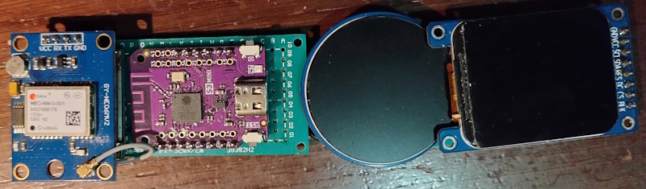
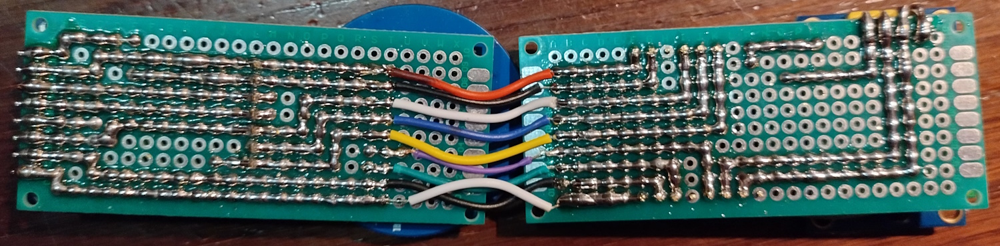

# A motorcycle computer based on ESP32


## Contents

- [Synopsis](#synopsis)
- [Features](#features)
- [Part List](#part-list)
- [How to build one](#how-to-build-one)
- [Schemes and connections](#schemes-and-connections)
- [Improvements list](#improvements-list)
- [Acknowledgements](#acknowledgements)
- [Disclaimer](#disclaimer)


## Synopsis

A small homemade motorcycle computer based on ESP32 controller to show some usefull information.
The project has been done thinking on the modularity, so new features can be added (or removed).

<br>
*ESP32 bike computer mounted on a Yamaha Tracer 9*


## Features

- Android phone connection using mitchwongho application ([see acknowledgements](#acknowledgements)):
    - Shows the phone battery level.
    - Shows message alerts (Whatssapp, Telegram, SMS...).
- Tire pressure level, temperature and low battery alert from TPMS BLE sensors.
- Date, time and altitude from GPS.
- Weather prediction from OpenWeatherMap.
- Speed limit and street name from Microsoft Maps.
- Sends GPS latitude and longitude to a web server.
- Shows the location from the web server on a map.

### Other features not implemented

Some features have been removed from this version because there are not longer needed:

- Temperature using a waterproof DS1820
- ECU connection to KDS system (my old bike was a kawasaky). Here are some good information for those interested:
    - https://github.com/aster94/Keyword-Protocol-2000
    - https://github.com/HerrRiebmann/KDS2Bluetooth


## Part list

- **ESP32 Mini D1**<br>
    It could work with other ESP32 boards but I have chose this for the small size. Be sure to choose one with two cores p.e. WROOM-32.
    
    

- **GPRS + GSM board SIM808**<br>
    Don't forget to choose two apropiate antennas for GPS and GSM radios.

    

- **SPI TFT**<br>
    One round 240x240 1,28" based on GC9A01 chip, and other square 240x280 1,69" based on ST7789 chip. These are cheap, fits on the case and they can be seen pretty clear under the sun light.

    
    

- **DJI Action2 case**<br>
    It is waterproof, both LCD's fits inside and you can remove one of the buttons to pass the cable through it. It has a standard gopro clip for holding it wherever you want. Choose the bracket that fits you better.

    
    

- **BLE 4.0 TPMS**<br>
    Bluetooth BLE 4.0 TPMS to control the tire pressure for Android / IOS application. Do not use BLE 5.0 model, is not supported by ESP32 at this moment.
    
    

- **Other stuff**
    - 2 * 8 pin 5cm dupond cables for LCDs.
    - A waterproof case for the ESP32 and SIM808.
    - 3x7cm PCB prototype breadboard.
    - Male and Female pin headers.
    - Black USB 3.0 male-female cable for ESP32 to LCD connection (9 pins).
    - Waterproof Usb C for wall mount.
    - Iron soldering kit.
    - Small silica gel bag for the LCD case. (Optional).    
    - Silicone thermal gun for sealing the junctions. (Optional).


## How to build one

1. Set a **public web server** to receive the information from the GPS and draw the route on a map.
If you do not want or need this function you can forget this step and comment the following line on "src/main.cpp" -> loop():
```
// sendGPRS();
```

Otherwise: 
- Download the files from [webpage](webpage) folder.
- Edit the sql scheme file, set your passwords and create a MariaDB database with the scheme and data to store the information.
- Edit the php files with your database server information.
- Save both php files on a folder served by the web server.


2. Get your OpenWeatherMap and Bing Maps API keys. You have to sign up on both services but the free tier should be enought.
     - https://openweathermap.org/api
     - https://www.bingmapsportal.com


3. Get all components and stuff listed below. They could be obtained from "all purpose" web pages like Aliexpress or Amazon.


4. Set your VCode + Platformio environment with the project from esp32-bike-computer-main folder. This step is too long to describe here and there is a lot of information on internet about how to do it :wink:
     - Create a "include/secrets.h" file and fill it with your data. E.g:
     ```
    #define HTTP_SERVER "my.server.com"
    #define HTTP_PATH "/bikefiles"   // Should begin with "/" and end without it
    #define WEATHER_APIKEY "yourOpenweathermapsAPIKey"
    #define WEATHER_CITYID "3104324"    // Zaragoza,ES Look for your location: https://www.openweathermap.org/find
    #define MAPS_APIKEY "yourBingMapsAPIKey"
    #define WEB_PASS "user_id0_pass_set_on_the_database"
    #define WIFI_SSID01 "SSID01_NAME"
    #define WIFI_PASS01 "SSID01_PASSWORD"
    #define WIFI_SSID02 "SSID02_NAME"
    #define WIFI_PASS02 "SSID02_PASSWORD"
     ```
     - Compile and upload it to the ESP32. 
     - Upload the "data" folder files to ESP32 SPIFFS.


5. Build the PCB following the [schemes/main.fzz](schemes/main.fzz) or [schemes/main_v2.fzz](schemes/main_v2.fzz). If you want to fit it on a 3x7cm protoboard only the following ESP32 pins must be soldered: RST, SVP, 26, 18, 19, 33, 23, 5, 3.3V, 22, 21, 17, 16, GND, VCC. 
     - [ESP32 pinout](docs/ESP32_D1_mini_pinout.png)


## Schemes and connections
There are some [Fritzing](https://fritzing.org/) schemes located on the [schemes](schemes) folder. There are created for soldering on a quick breadboard. I have glue a small square of plastic sponge to support the SIM808 module.






The connectors placement on the board are:
- SIM808: S3-S9
- ESP32 left: P3-P10,Q6
- ESP32 right: G3-G8
- Power terminal: C3 and C5

There is a "v2" version that is untested, but the only change is the USB cable connector order for a better route on the breadboard, so it should work.


## Improvements list

- **A 3D design** for the ESP32+SIM808 case. ~~Now I am using a small plastic tapperware :sweat_smile:~~ Done. Take a look at [3d_designs](3d_designs) folder.

- **Kickstand alert**<br>
    Using and ELM327 to communicate with the ECU, but I am not able to find the correct OBD PID. There are some projects to help with it, like: https://github.com/PowerBroker2/ELMduino

- **Turn by turn indications**<br>
    I am not able to find or build an application to send the indications by BLE. Maybe could find an aproach using Msoft Maps?...

- **Telegram communication**<br>
    To receive bike location and ¿maybe? set configuration

- **Web server for configuration**<br>
    To change some values (API keys, passwords...) and save it to the EEPROM.  I had problems using the wifi and the BLE stack at the same time.

- **Parking sensor.** ~~Because... Why not?~~ Done. Take a look at https://github.com/m-gracia/esp32-bike-computer-back


## Acknowledgements

Many thanks to the programmers that works and maintain the libraries used on this project, expecially @mitchwongho for his great application:

- <https://github.com/mitchwongho/ESP-Alerts-for-Arduino>
- <https://github.com/mitchwongho/ESP-Alerts-for-Android>
- <https://github.com/ra6070/BLE-TPMS>
- <https://github.com/olikraus/u8g2>
- <https://github.com/moononournation/Arduino_GFX>
- <https://github.com/JChristensen/Timezone>
- <https://github.com/vshymanskyy/TinyGSM>
- <https://github.com/bblanchon/ArduinoJson>

And thank you VANEP and UniquePete for your Fritzing desigs: 
- <https://forum.fritzing.org/u/vanepp/summary>
- <https://forum.fritzing.org/u/UniquePete/summary>


## Disclaimer

I'm not a professional programmer neither an electronics expert, I'm just making this for fun and learn.

I want to share this to the community just in case someone else find it funny or usefull for his/her own project, I havent got other pretensions, so please:

1. I'm pretty sure the code is not perfectly written and does not follow the standars or etiquette, it just works for me. I will be more than pleasured to hear improvements and learn.
2. I have not tested so much this thing and sometimes it does have minor failures (GPS fail to get data, GPRS fail to connect to server...). I am happy with it but if you don't, please, don't waste your money.
3. Use at your own risk. I'm not responsible for any damages, direct or indirect. Remember: "It works for me" is the only test I have done.
4. I would be glad to read your comments, questions, doubts, jokes, etc. and will try to answer all of them, but I have made this on my spare time that is not so much, so don't expect a quick response. My apologies in advance.